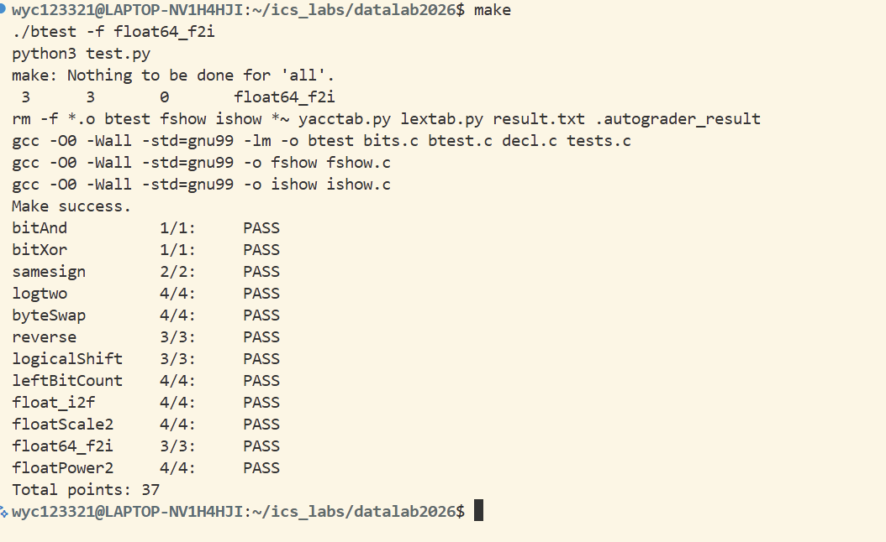

# datalab 报告

姓名：吴宜宸

学号：2025201729

test 截图：


bitAnd          1/1:     PASS
bitXor          1/1:     PASS
samesign        2/2:     PASS
logtwo          4/4:     PASS
byteSwap        4/4:     PASS
reverse         3/3:     PASS
logicalShift    3/3:     PASS
leftBitCount    4/4:     PASS
float_i2f       4/4:     PASS
floatScale2     4/4:     PASS
float64_f2i     3/3:     PASS
floatPower2     4/4:     PASS
Total points: 37

## 解题报告

### 亮点
1. float_i2f
2. leftBitCount

### float_i2f
```c
unsigned float_i2f(int x) {
    if (x == 0) return 0;
    if (x == 0x80000000) return 0xCF000000;

    unsigned sign = x & 0x80000000;
    if (sign) x = -x;

    int e = 0;
    int temp = x;
    while (temp >>= 1) {
        e++;
    }

    unsigned exp = (e + 127) << 23;
    unsigned F;

    if (e <= 23) {
        F = (x << (23 - e)) & 0x7FFFFF;
    } else {
        int shift = e - 23;
        F = (x >> shift) & 0x7FFFFF;
        unsigned mask = (1 << shift) - 1;
        unsigned half = 1 << (shift - 1);
        unsigned remainder = x & mask;

        if (remainder > half) {
            F++;
        } else if (remainder == half) {
            if (F & 1) F++;
        }

        if (F & 0x800000) {
            F = 0;
            exp += 0x00800000;
        }
    }
    return sign | exp | F;
}

解题思路：
这道题要求将整型转为单精度浮点数的二进制表示，核心在于完全契合 IEEE 754 标准。

特殊值处理：首先处理 x==0 和 x==0x80000000（最小负数，取反会溢出）的情况。

符号位与绝对值：提取第 31 位作为符号位，若为负数则取绝对值，方便统一处理。

计算指数：由于不允许乘法，采用 while 循环配合右移，统计最高位 1 的位置 e，则真实指数为 e + 127。

尾数提取与舍入（难点）：如果有效位数 e > 23，需要右移截断。此处在截断时实现了向最近偶数舍入（Round to Nearest Even）：提取出截断余数 remainder 和中间值 half，若余数大于一半，或者恰好等于一半且尾数当前是奇数（F & 1），则进位。最后判断尾数进位是否溢出到指数位，若溢出则清零尾数并增加指数。

### leftBitCount
```c
int leftBitCount(int x) {
    int count = 0;
    int shift;

    shift = !((x >> 16) + 1) << 4; count += shift; x <<= shift;
    shift = !((x >> 24) + 1) << 3; count += shift; x <<= shift;
    shift = !((x >> 28) + 1) << 2; count += shift; x <<= shift;
    shift = !((x >> 30) + 1) << 1; count += shift; x <<= shift;
    shift = !((x >> 31) + 1);      count += shift; x <<= shift;
    count += !((x >> 31) + 1);

    return count;
}
解题思路：
这道题要求统计从最高位开始连续 1 的个数，且严禁使用 if、== 等条件判断，这是一道分治法题目。

我采用了分治思想：采用“折半”策略，依次检查高 16 位、8 位、4 位、2 位、1 位是否全为 1。例如，如果高 16 位全为 1，则 count += 16，并将 x 左移 16 位，把已经检查过的部分“丢弃”，继续对剩余位重复此过程。
无分支判断技巧（全 1 判定）：利用算术右移的特性，如果高位全为 1（负数），则 x >> n 得到的是全 1（0xFFFFFFFF），此时 (x >> n) + 1 会溢出变为 0。因此，表达式 !((x >> 16) + 1) 在“高位全 1”时返回 1，否则返回 0。
权值拼接：将上述布尔值（0 或 1）左移对应的位数（如 << 4 表示 16），即可作为步长 shift 累加到 count 中。
边界处理：前 5 步总共只覆盖了 31 位，因此最后还需要单独判断最高位 1 次。
此解法避开了所有不合规的操作符，且操作符数量严格控制在 50 以内。
### ......

## 反馈/收获/感悟/总结

## 反馈/收获/感悟/总结

本次实验让我收获了：
1. 底层数据表示：深入理解了补码、算术/逻辑右移的区别，以及 IEEE 754 浮点数的符号位、指数偏移、尾数隐含 1 和舍入规则。
2. 位运算与分治：学会了用德摩根定律和无分支编程替代条件判断，并通过 `logtwo`、`leftBitCount` 等题目掌握了二分法与分治思想。
3. 工程能力：从配置 WSL2、解决网络代理问题，到熟练使用 Git 提交和推送代码，完整走通了实验环境搭建与仓库管理流程。
4. 严谨习惯：在操作符数量严格受限下，养成了精确计算和逐位调试的习惯，为后续系统实验打下了基础。

## 参考的重要资料

<!-- 有哪些文章/论文/PPT/课本对你的实现有重要启发或者帮助，或者是你直接引用了某个方法 -->

<!-- 请附上文章标题和可访问的网页路径 -->
